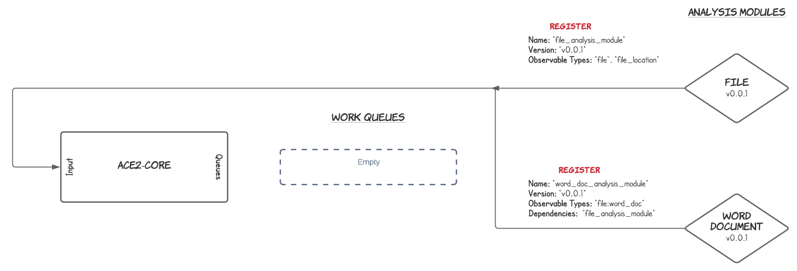
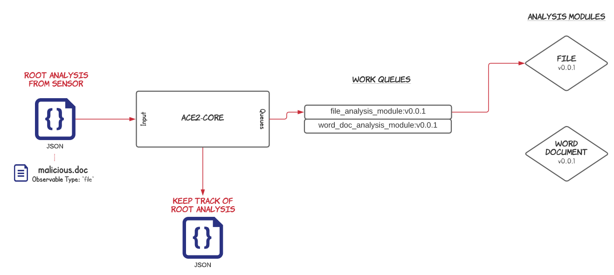
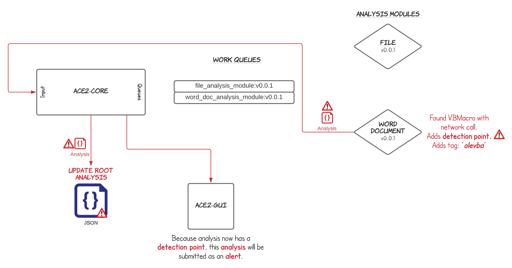

# Example Flow

Let's follow a simple example to show--at a high level--how data goes from just data to an [alert](../design/alerts.md)
while being analyzed/processed by ace2-core.

In this example, we will register analysis modules specifically to look for malicious word documents.
Then, we will assume a sensor submits a word document for analysis.

## Register Analysis Modules

[Analysis modules](../design/analysis_module.md) process [observables](../design/observable.md) to see if an
[alert](../design/alerts.md) should be created for the Security Analysts.
In this example, we will register four analysis modules:

- **File Type** analysis module
    - Accepts "_file_" observable types and outputs the type of file. For example: PDF, Word Document,
      Email, etc.
- **File Hash** analysis module
    - Accepts "_file_" observable types and outputs the hash of the file.
- **Virus Total** analysis module
    - Accepts "_sha256_hash_" observable types and outputs if the file has been identified as malicious or not.
    - May also add observables like file names, etc.
- **Word Document** analysis module
    - Accepts "_file:word_doc_" observables and outputs if the word doc is malicious.
    - May also add observables like URLs from within the document, screenshots of the document content, etc.

## Analysis Module Queues and Mapping

After receiving the registration requests from the analysis modules, ace2-core will create a queue dedicated to the
analysis module and will add the analysis module to a map containing observable types and the analysis modules that
can process those observable types.

## Analysis Submission

Now that ace2-core has analysis modules ready to analyze observables, a sensor will submit a
[root analysis](../design/root_analysis.md) which contains an observable with type "_file_".

Ace2-core will keep track of the root analysis and add analysis module results throughout the lifetime of the
root analysis.

Then, ace2-core will grab the observables within the root analysis and place them in the appropriate
queue(s) for analysis modules that accept "_file_" observable types. In this case, we only have one observable.

## Handling Analysis Module Results

The File Type and File Hash analysis modules will both send their analysis results back to ace2-core. These results
will include [tags](../design/tags.md), [directives](../design/directives.md), 
[detection points](../design/detection_points.md), more observables, etc.

Ace2-core will then add these details to the root analysis, and then place any observables discovered by the analysis
modules into the appropriate queue(s) for further analysis.

## An Alert Is Born

After this round of analysis, Virus Total does not show any results related to the "_sha256_hash_" observable type.
However, the word document found a Visual Basic macro that contained a function known to make network calls. This
is suspicious and is worth being presented to a Security Analyst.

The Word Document analysis module will add a detection point to note that it has detected something that should be
looked at further by an analyst.

Once the analysis is submitted back to ace2-core, ace2-core will add the analysis to the root analysis object. Then,
ace2-core will see there is ia detection point and will submit the root analysis as an alert to ace2-gui.

