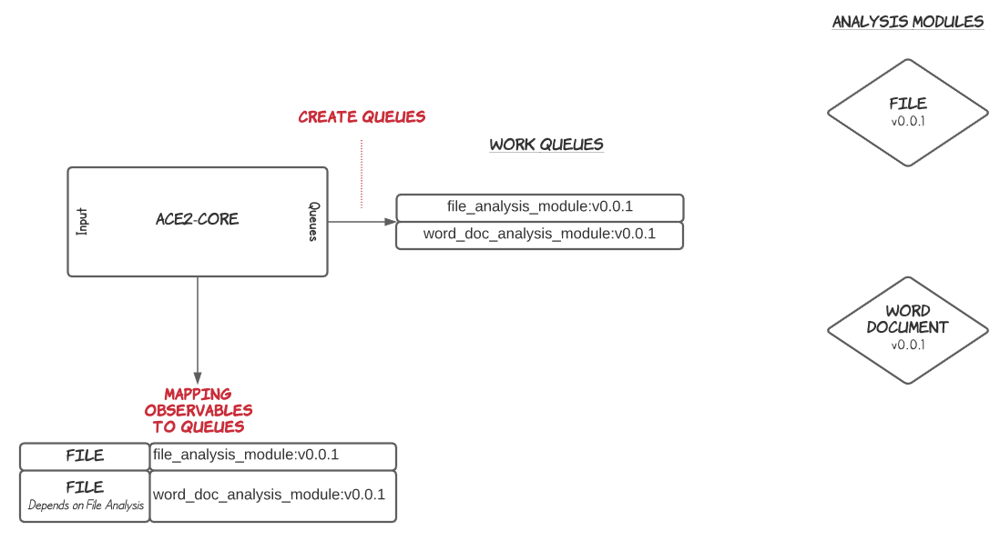

# Example Flow

Let's follow a simple example to show how an [alert](../design/alerts.md) gets created by ACE.

In this example we register analysis modules specifically to look for malicious word documents.
Then we assume a sensor submits a word document for analysis.

## Register Analysis Modules

[Analysis modules](../design/analysis_module.md) process [observables](../design/observable.md) to see if an
[alert](../design/alerts.md) should be created.

In this example we register two analysis modules:

- **File Type** analysis module
    - Accepts "_file_" observable types and outputs the type of file. For example: PDF, Word Document,
      Email, etc.
    - Adds tags like "_word_doc_", "_pdf_", "_email_", etc. depending on the file type analysis result.
- **Word Document** analysis module
    - Accepts "_file_" observables and outputs if the word doc is malicious. This module depends on the File Type module to determine if a file is malicious or not.
    - May also add more observables like URLs from within the document, screenshots of the document content, etc.

## Analysis Module Queues and Mapping

Ace receives the registration requests from the analysis modules and creates a queue dedicated to each.

## Analysis Submission

A sensor submits a [root analysis](../design/root_analysis.md) which contains an observable with type "_file_".

Ace keeps track of the root analysis and add analysis module results throughout the lifetime of the root analysis.

Ace then creates _observable analysis requests_ for each observable within the root analysis and places them in the 
appropriate queue(s) for analysis modules that accept "_file_" observable types. In this case, we only have one observable.

## Handling Analysis Module Results

The File Type modules receives the analysis request through its queue and then posts analysis results back to ACE. These results 
may include things like [tags](../design/tags.md), [directives](../design/directives.md), 
[detection points](../design/detection_points.md), more observables, etc.

ACE adds the analysis result to the root analysis, and then places any additional observables discovered by the analysis
module into the appropriate queue(s) for further analysis.

## An Alert Is Born
The word document analysis module found a Visual Basic macro that contained a function known to make network calls. This
is suspicious and worth being presented to a security analyst.

The Word Document analysis module adds a detection point to note that it has detected something that should be
manually reviewed by an analyst. The analysis module also adds a tag ("_olevba_"), which will be presented to the 
analyst on an alert page in the GUI. This tag will give the analyst an immediate sense of what they're looking at or
looking for.

Once the analysis is submitted back to ACE, ACE adds the analysis to the root analysis object. ACE sees there is a 
detection point and will submit the root analysis as an alert for analyst review.

